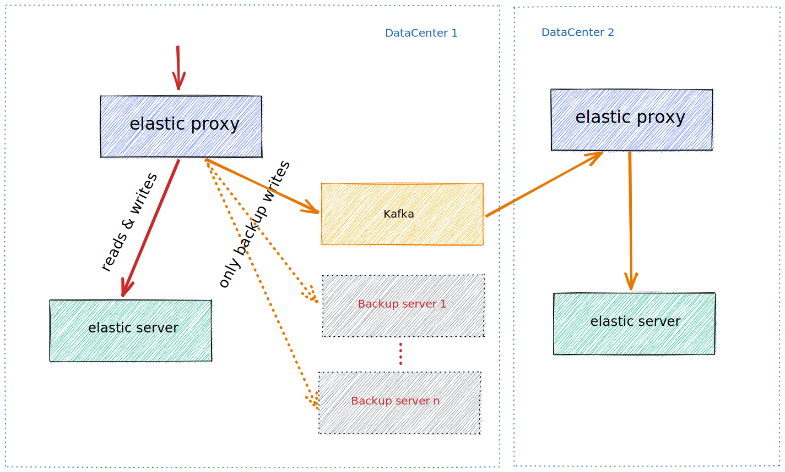

# elasticproxy

This little program acts as a http proxy for ElasticSearch.



## Features TODO

- [ ] WAL log and recover
- [ ] Primary timeout
- [ ] Backup retries
- [ ] Loop back avoiding
- [x] Kafka consuming to replay elastic write events 2022-04-28
- [x] YAML config file 2022-04-28
- [x] Backup to Kafka 2022-04-28

## build, start

1. build: `make install`
2. initialize: `elasticproxy -init` (this will create ctl shell script for convenience of startup or stop)
3. start [httplive](https://github.com/bingoohuang/httplive), for backup mocking: `httplive -l`
   , [download httplive](http://7.d5k.co/httplive/dl/)
4. edit the created conf.yml file at the current working directory, [example](initassets/conf.yml)
5. start: `./ctl start`
6. tail log: `./ctl tail`

## usage

```sh
$ elasticproxy -h
Usage of elasticproxy:
  -conf (-c) string     config file (default "./conf.yml")
  -init Create initial ctl and exit
  -version (-v) Create initial ctl and exit
```

```sh
$ ./ctl tail
2022-04-28 11:19:40.713 [INFO ] 34444 --- [1    ] [-]  : log file created:~/logs/elasticproxy/elasticproxy.log
2022-04-28 11:19:43.051 [INFO ] 34444 --- [26   ] [-]  : {"direction":"primary","duration":"25.07109ms","method":"POST","path":"/person/doc","remote_addr":"127.0.0.1:51963","status":201,"target":"http://127.0.0.1:9200/person/doc"}
2022-04-28 11:19:43.053 [INFO ] 34444 --- [25   ] [-]  : {"direction":"backup","duration":"2.400444ms","status":200,"target":"http://127.0.0.1:5003/backup/person/doc"}
2022-04-28 11:19:43.054 [INFO ] 34444 --- [25   ] [-]  : backup elastic backup http://127.0.0.1:5003/backup cost 2.606671ms successfully
2022-04-28 11:19:43.054 [INFO ] 34444 --- [25   ] [-]  : kafka write size: 454, message: {"host":"127.0.0.1:2900","remoteAddr":"127.0.0.1:51963","method":"POST","url":"/person/doc","header":{"Accept":["application/json"],"Accept-Encoding":["gzip, deflate"],"Content-Length":["142"],"Content-Type":["application/json"],"Gurl-Date":["Thu, 28 Apr 2022 03:19:42 GMT"],"User-Agent":["gurl/1.0.0"]},"body":{"addr":"西藏自治区那曲地区羯聵路5254号觪皉小区5单646751199202275103","name":"宋邅槐","sex":"男"}\n},to kafka
2022-04-28 11:19:43.061 [INFO ] 34444 --- [25   ] [-]  : kafka.produce result &{Partition:0 Offset:6 Topic:elastic.backup}
2022-04-28 11:19:43.061 [INFO ] 34444 --- [25   ] [-]  : backup backup to kafka cost 7.151284ms successfully
```

## help commands

1. `docker-compose up && docker-compose rm -fsv`
2. `jj -gu 'name=@姓名' 'sex=@random(男,女)' 'addr=@地址' 'idcard=@身份证' | gurl POST :2900/person/doc`
   , [download jj](http://7.d5k.co/httplive/dl/)
3. `gurl http://127.0.0.1:2900/_search` vs `http://127.0.0.1:9200/_search`
   , [download gurl](http://7.d5k.co/httplive/dl/)
4. elastic search `gurl :9200/person/_search q=宣來芼`
