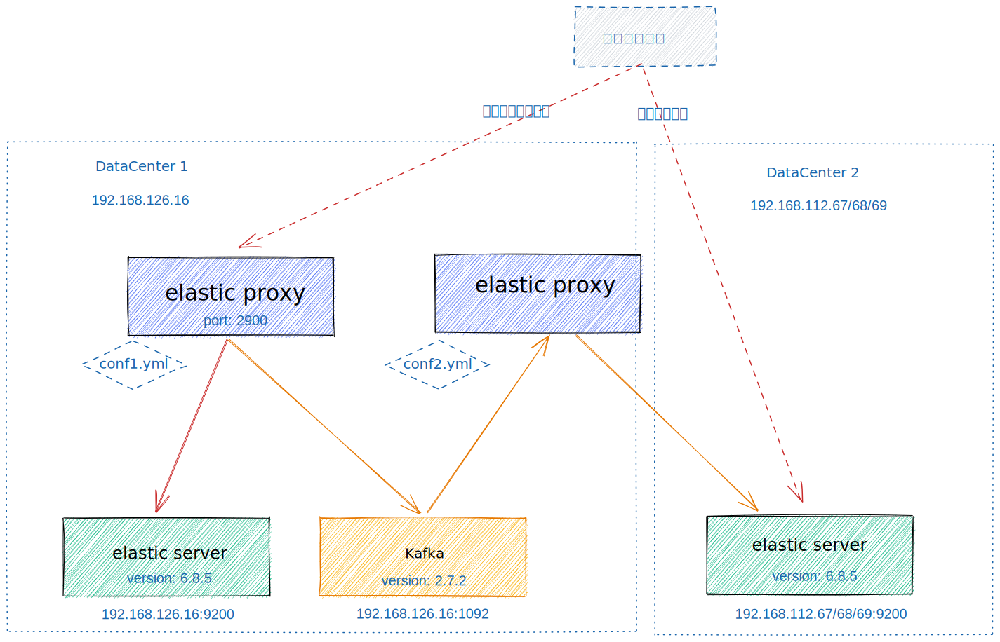

# 验证环境相关

## 部署图



## 安装 kafka 2.7.2

1. 2.7.2 Released November 15, 2021
2. 2.7.1 Released May 10, 2020
3. 2.7.0 Released Dec 21, 2020

- 2.7.2 是最后一个还是只用 zk 的版本，主要是去除ZK的版本，是否稳定，社区其他对应的工具是否都支持了，例如 kafka manager 或者其他 golang 和 java 的 SDK
  是否又有成熟的，还有跟旧版本的兼容性，例如，telegraf的kafka output，最新的肯定不是最好的，最少1年以上的版本吧，我估计社区差不多成熟了
- 小版本找最新的就行，一般都是修复bug的，功能上没有改动

[kafka quickstart](https://kafka.apache.org/documentation/#quickstart)

```sh
# Start the ZooKeeper service
# Note: Soon, ZooKeeper will no longer be required by Apache Kafka.
$ bin/zookeeper-server-start.sh config/zookeeper.properties
# Start the Kafka broker service
$ bin/kafka-server-start.sh config/server.properties
```

[kafka_2.13-2.7.2/config/zookeeper.properties](http://127.0.0.1:8334/view/home/footstone/bingoo/kafka_2.13-2.7.2/config/zookeeper.properties)

```properties
# the directory where the snapshot is stored.
dataDir=data/zookeeper-data
# the port at which the clients will connect
clientPort=2081
```

[kafka_2.13-2.7.2/config/server.properties](http://127.0.0.1:8334/view/home/footstone/bingoo/kafka_2.13-2.7.2/config/server.properties)

```properties
listeners=PLAINTEXT://:59092
log.dirs=data/kafka-logs
zookeeper.connect=localhost:2081
```

```sh
[footstone@fs02-192-168-126-16 kafka_2.13-2.7.2]$ more start.sh
nohup bin/zookeeper-server-start.sh config/zookeeper.properties 3>&1>> zk.nohup.log &
nohup bin/kafka-server-start.sh config/server.properties 2>&1 >> kafka.nohup.log &
```

## RSS usage tracking

```sh
[footstone@fs02-192-168-126-16 kafka2elastic]$ ps aux | awk 'NR==1 || /elasticproxy$/'
USER       PID %CPU %MEM    VSZ   RSS TTY      STAT START   TIME COMMAND
footsto+  9396  1.5  0.0 718192 17488 pts/12   Sl   17:10   0:00 elasticproxy
footsto+ 14008  4.5  0.0 717360 16656 pts/4    Sl   17:10   0:00 elasticproxy
```
