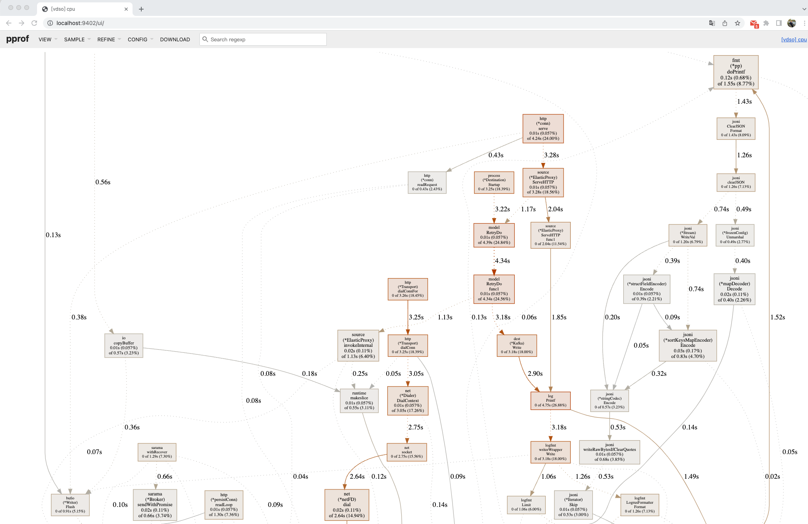

# 使用说明

elasticproxy 通过反向代理和 kafka 对象，提供两个 elasticsearch 集群之间的数据同步功能。如果需要双向同步，则反方向部署一套同步系统即可。

## 前提

1. kafka 必须在 0.10.2.0 以上版本（建议 2.7.2 ）
> 理由：2.7.2 是最后一个还是只用 zk 的版本，主要是去除ZK的版本，是否稳定，社区其他对应的工具是否都支持了，例如 kafka manager 或者其他 golang 和 java 的 SDK
是否又有成熟的，还有跟旧版本的兼容性，例如，telegraf 的 kafka output，最新的肯定不是最好的，最少1年以上的版本吧，我估计社区差不多成熟了
> 小版本找最新的就行，一般都是修复bug的，功能上没有改动

发布日期：
- 2.7.2 Released November 15, 2021
- 2.7.1 Released May 10, 2020
- 2.7.0 Released Dec 21, 2020

2. elasticsearch 建议在 6.8.5 以上

- 理由：目前一键部署都是默认该版本，
- 发布时间 [Elasticsearch 6.8.5 November 21, 2019](https://www.elastic.co/cn/downloads/past-releases#elasticsearch)
- 最新： Elasticsearch 8.2.0 May 04, 2022

## 安装

1. 方式 1：通过相关渠道获得可执行文件
2. 方式 2：自己编译（下载源码, make install 编译本机版本，make linux 编译 amd64 linux 版本）

## 初始化

1. 创建两个工作目录
- elasticproxy 目录， 提供 elasticsearch 的反向代理和写 kafka 功能，比如 `mkdir -p elasticproxy && cd elasticproxy`
- kafka2elastic 目录， 提供消费 kafka 同步到另外一个 elasticsearch 的功能，比如 `mkdir -p kafka2elastic && cd kafka2elastic`
2. 在各自工作目录下执行初始化，`elasticproxy -init` 初始化，生成示例配置文件 `conf.yml` 以及 控制脚本 `ctl`
3. 编辑配置 `conf.yml`， 配置文件，修改配置，参考对应下面示例部署图的两个示例配置文件
- elasticproxy 的示例配置 [conf1.yml](testdata/testenv/conf1.yml)
- kafka2elastic 的示例配置 [conf2.yml](testdata/testenv/conf2.yml)
4. 在各自工作目录下启动程序 `./ctl start` (相对应的命令，停止 `./ctl stop`，重启 `./ctl restart`)
5. 在各自工作目录下跟踪查看日志 `./ctl tail`

## 示例部署图


其中：

1. 使用 `conf1.yml` 配置的 elasticproxy 程序，负责提供一个 http 反向代理，接收 http 请求，反向代理到真实的的 elasticsearch 上，并且对写请求，写入 kafka 消息队列
2. 使用 `conf2.yml` 配置的 elasticproxy 程序，负责消费 kafka，同步到另外的 elasticsearch 上

## 验证安装是否成功

通过反向代理，写入数据： `gurl -b '{"addr":"@地址","idcard":"@身份证","name":"@姓名","sex":"@性别"}' http://192.168.126.16:2900/test1/_doc/@ksuid`

```sh
$ gurl -b '{"addr":"@地址","idcard":"@身份证","name":"@姓名","sex":"@性别"}' http://192.168.126.16:2900/test1/_doc/@ksuid
Conn-Session: 2.0.1.13:62403->192.168.126.16:2900 (reused: false, wasIdle: false, idle: 0s)
POST /test1/_doc/29bKOROUFVvRVQIlsrGYYzJwuTy HTTP/1.1
Host: 192.168.126.16:2900
Accept: application/json
Accept-Encoding: gzip, deflate
Content-Type: application/json
Gurl-Date: Tue, 24 May 2022 07:11:52 GMT
User-Agent: gurl/1.0.0

{
"addr": "湖北省宜昌市炦芣路935号坷鈣小区19单元2260室",
"idcard": "548797200502036828",
"name": "路絁猭",
"sex": "女"
}

HTTP/1.1 201 Created
Date: Tue, 24 May 2022 07:11:53 GMT
Content-Length: 179
Content-Type: text/plain; charset=utf-8

{
"_index": "test1",
"_type": "_doc",
"_id": "29bKOROUFVvRVQIlsrGYYzJwuTy",
"_version": 1,
"result": "created",
"_shards": {
"total": 2,
"successful": 1,
"failed": 0
},
"_seq_no": 0,
"_primary_term": 1
}

2022/05/24 15:11:53.489314 main.go:163: current request cost: 529.989062ms
Complete, total cost:  530.136099ms
```

查询数据（查询反向代理、查询真实 es 的两个集群），替换其中的 IP 和 端口即可，应该查的相同的数据

```sh
$ gurl GET 192.168.112.67:9200/person/_search size=1 -pb q=路絁猭
{
"took": 78,
"timed_out": false,
"_shards": {
"total": 5,
"successful": 5,
"skipped": 0,
"failed": 0
},
"hits": {
"total": 114364,
"max_score": 9.766472,
"hits": [
{
"_index": "person",
"_type": "_doc",
"_id": "29YSWP35SuVv48iVCoprrwh4AuP",
"_score": 9.766472,
"_source": {
"addr": "宁夏回族自治区银川市縳杠路562号嬳婣小区13单元316室",
"idcard": "636325201304260336",
"name": "翟夨猭",
"sex": "男"
}
}
]
}
}
```

## 诊断

1. 进入目标工作目录（ctl 和 conf.yml 所在的目录)
```sh
$ cd elasticproxy/
$ pwd
/home/footstone/elasticproxy
$ ls
conf.yml  cpu.profile  ctl  var
```
2. 查看当前进程运行状态（中间有 PID）
```sh
$ ./ctl status
elasticproxy started, pid=14008
```
3. 通知采集 5 分钟之内的进程运行信息，注意下面的 `$pid` 请换成上面的实际值，比如 `14008`，同时可以使用 `./ctl tail` 查看最新的日志
```sh
$ echo 5m > jj.cpu
$ kill -USR1 $pid
$ ./ctl tail
2022-05-24 14:36:16.777 [INFO ] 14008 --- [20   ] [-]  : cpu.profile started
2022-05-24 14:36:16.777 [INFO ] 14008 --- [20   ] [-]  : after 5m, cpu.profile will be generated
...
2022-05-24 14:39:36.307 [INFO ] 14008 --- [51   ] [-]  : kafka write size: 397, message: {"body":{"addr":"江苏省无锡市嶻哎路439号喸幈小区16单元1950室","idcard":"364948198406056606","name":"闻人猶穽","sex":"男"},"clusterIds":["29HMKmglGqiRromQBrI3nyWQcyw"],"header":{"Content-Type":["application/json"]},"host":"127.0.0.1:2900","labels":null,"method":"POST","remoteAddr":"127.0.0.1:64420","requestUri":"/person/_doc/29bGScTpHCQboxtWDsRhhoZK7g9"},to kafka
2022-05-24 14:39:36.325 [INFO ] 14008 --- [51   ] [-]  : kafka.produce result {"Partition":0,"Offset":134329,"Topic":"elastic16.backup"}
2022-05-24 14:40:32.453 [INFO ] 14008 --- [791645] [-]  : access log: {"RemoteAddr":"127.0.0.1:2345","Method":"POST","Path":"/person/_doc/29bGaDkJt9kkqmYpvtRYq4ZlxGJ","Target":"http://192.168.126.16:9200/person/_doc/29bGaDkJt9kkqmYpvtRYq4ZlxGJ","Direction":"primary","Duration":"29.114144ms","StatusCode":201,"ResponseBody":{"_index":"person","_type":"_doc","_id":"29bGaDkJt9kkqmYpvtRYq4ZlxGJ","_version":1,"result":"created","_shards":{"total":2,"successful":2,"failed":0},"_seq_no":7,"_primary_term":1}}
2022-05-24 14:40:36.308 [INFO ] 14008 --- [51   ] [-]  : kafka write size: 393, message: {"body":{"addr":"广东省韶关市說芲路4348号哣廳小区17单元234室","idcard":"316970200006169943","name":"叶絕炬","sex":"女"},"clusterIds":["29HMKmglGqiRromQBrI3nyWQcyw"],"header":{"Content-Type":["application/json"]},"host":"127.0.0.1:2900","labels":null,"method":"POST","remoteAddr":"127.0.0.1:2345","requestUri":"/person/_doc/29bGaDkJt9kkqmYpvtRYq4ZlxGJ"},to kafka
2022-05-24 14:40:36.324 [INFO ] 14008 --- [51   ] [-]  : kafka.produce result {"Partition":0,"Offset":134330,"Topic":"elastic16.backup"}
2022-05-24 14:41:16.798 [INFO ] 14008 --- [791584] [-]  : cpu.profile collected
```
4. 运行压力测试，或者等待（最好是在系统有业务负载的时候）5分钟，查看生成的 `cpu.profile` 文件的大小
```sh
$ ls -lh *cpu*
-rw-rw-rw- 1 footstone footstone 61K 5月  24 14:19 cpu.profile
```
5. 下载 `cpu.profile`，使用 go 工具开启可视化查看 `go tool pprof -http :9402 cpu.profile`


## 压测数据

20 万单条 POST 数据压测结果

| 目标               | TPS  | 损失  |
|------------------|------|-----|
| elasticproxy 代理  | 730  | 40% |
| elasticsearch 原始 | 1200 | -   |

原始输出：

```sh
[footstone@fs02-192-168-126-16 bingoo]$ BLOW_STATUS=-201  berf 192.168.126.16:2900/p3/_doc/@ksuid -b persons.txt:line  -opt eval,json -basic ZWxhc3RpYzoxcWF6WkFRIQ -vv
Log details to: ./blow_20220524163840_2009974412.log
Berf benchmarking http://192.168.126.16:2900/p3/_doc/@ksuid using 100 goroutine(s), 12 GoMaxProcs.
@Real-time charts is on http://127.0.0.1:28888

Summary:
Elapsed             4m32.132s
Count/RPS      200000 734.937
200               318 1.169
201          199682 733.768
ReadWrite    1.781 2.401 Mbps
Connections               100

Statistics    Min      Mean      StdDev       Max
Latency   2.773ms  135.869ms  295.123ms  8.665835s
RPS          1      760.33     406.06     1741.79

Latency Percentile:
P50          P75        P90       P95        P99       P99.9     P99.99
82.683ms  126.133ms  223.207ms  379.65ms  1.087599s  4.326544s  8.358918s

Latency Histogram:
93.919ms   171644  85.82%  ■■■■■■■■■■■■■■■■■■■■■■■■■■■■■■■■■■■■■■■■
214.442ms   21007  10.50%  ■■■■■
463.175ms    5095   2.55%  ■
1.005927s    1509   0.75%
1.531131s     159   0.08%
2.972024s     363   0.18%
6.034726s     222   0.11%
8.665835s       1   0.00%
[footstone@fs02-192-168-126-16 bingoo]$ BLOW_STATUS=-201  berf 192.168.126.16:9200/p4/_doc/@ksuid -b persons.txt:line  -opt eval,json -basic ZWxhc3RpYzoxcWF6WkFRIQ -vv
Log details to: ./blow_20220524164744_758281360.log
Berf benchmarking http://192.168.126.16:9200/p4/_doc/@ksuid using 100 goroutine(s), 12 GoMaxProcs.
@Real-time charts is on http://127.0.0.1:28888

Summary:
Elapsed             2m49.982s
Count/RPS     200000 1176.589
201         200000 1176.589
ReadWrite    3.163 3.844 Mbps
Connections               100

Statistics    Min      Mean     StdDev      Max
Latency   1.549ms  84.844ms  158.59ms  3.674785s
RPS         29      1176.3    750.6     3461.79

Latency Percentile:
P50         P75       P90        P95        P99       P99.9     P99.99
37.976ms  80.54ms  168.923ms  304.081ms  883.682ms  1.545685s  2.553689s

Latency Histogram:
45.09ms    152119  76.06%  ■■■■■■■■■■■■■■■■■■■■■■■■■■■■■■■■■■■■■■■■
112.236ms   32954  16.48%  ■■■■■■■■■
279.471ms   10421   5.21%  ■■■
595.99ms     3063   1.53%  ■
1.011403s     998   0.50%
1.371014s     391   0.20%
2.274201s      48   0.02%
3.090254s       6   0.00%
```
