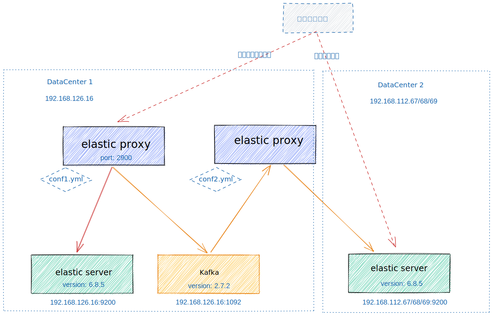

# 使用说明

elasticproxy 通过反向代理和 kafka 对象，提供两个 elasticsearch 集群之间的数据同步功能。如果需要双向同步，则反方向部署一套同步系统即可。

## 前提

1. kafka 必须在 0.10.2.0 以上版本（建议 2.7.2 ）
> 理由：2.7.2 是最后一个还是只用 zk 的版本，主要是去除ZK的版本，是否稳定，社区其他对应的工具是否都支持了，例如 kafka manager 或者其他 golang 和 java 的 SDK
是否又有成熟的，还有跟旧版本的兼容性，例如，telegraf 的 kafka output，最新的肯定不是最好的，最少1年以上的版本吧，我估计社区差不多成熟了
> 小版本找最新的就行，一般都是修复bug的，功能上没有改动

发布日期：
- 2.7.2 Released November 15, 2021
- 2.7.1 Released May 10, 2020
- 2.7.0 Released Dec 21, 2020

2. elasticsearch 建议在 6.8.5 以上

- 理由：目前一键部署都是默认该版本，
- 发布时间 [Elasticsearch 6.8.5 November 21, 2019](https://www.elastic.co/cn/downloads/past-releases#elasticsearch)
- 最新： Elasticsearch 8.2.0 May 04, 2022

## 安装

1. 方式 1：通过相关渠道获得可执行文件
2. 方式 2：自己编译（下载源码, make install 编译本机版本，make linux 编译 amd64 linux 版本）

## 初始化

1. 创建两个工作目录
- elasticproxy 目录， 提供 elasticsearch 的反向代理和写 kafka 功能，比如 `mkdir -p elasticproxy && cd elasticproxy`
- kafka2elastic 目录， 提供消费 kafka 同步到另外一个 elasticsearch 的功能，比如 `mkdir -p kafka2elastic && cd kafka2elastic`
2. 在各自工作目录下执行初始化，`elasticproxy -init` 初始化，生成示例配置文件 `conf.yml` 以及 控制脚本 `ctl`
3. 编辑配置 `conf.yml`， 配置文件，修改配置，参考对应下面示例部署图的两个示例配置文件
- elasticproxy 的示例配置 [conf1.yml](testdata/testenv/conf1.yml)
- kafka2elastic 的示例配置 [conf2.yml](testdata/testenv/conf2.yml)
4. 在各自工作目录下启动程序 `./ctl start` (相对应的命令，停止 `./ctl stop`，重启 `./ctl restart`)
5. 在各自工作目录下跟踪查看日志 `./ctl tail`

## 示例部署图



其中：

1. 使用 `conf1.yml` 配置的 elasticproxy 程序，负责提供一个 http 反向代理，接收 http 请求，反向代理到真实的的 elasticsearch 上，并且对写请求，写入 kafka 消息队列
2. 使用 `conf2.yml` 配置的 elasticproxy 程序，负责消费 kafka，同步到另外的 elasticsearch 上

## 验证安装是否成功

通过反向代理，写入数据： `gurl -b '{"addr":"@地址","idcard":"@身份证","name":"@姓名","sex":"@性别"}' http://192.168.126.16:2900/test1/_doc/@ksuid`

```sh
[footstone@fs02-192-168-126-16 ~]$ gurl 'name=@姓名' 'sex=@random(男,女)' 'addr=@地址' 'idcard=@身份证' -ugly :2900/person/_doc/@ksuid -raw -pa
Conn-Session: 127.0.0.1:45842->127.0.0.1:2900 (reused: false, wasIdle: false, idle: 0s)
POST /person/_doc/29c4ORiakYfPcUD0qRpsUcKTbkw HTTP/1.1
Host: 127.0.0.1:2900
Accept: application/json
Accept-Encoding: gzip, deflate
Content-Type: application/json
Gurl-Date: Tue, 24 May 2022 13:30:07 GMT
User-Agent: gurl/1.0.0

{"addr":"湖南省益阳市鮄犫路2311号陈房小区12单元1499室","idcard":"422135201404041412","name":"通觅惋","sex":"男"}
HTTP/1.1 201 Created
Server: fasthttp
Date: Tue, 24 May 2022 13:30:07 GMT
Content-Type: application/json; charset=UTF-8
Content-Length: 181
Location: /person/_doc/29c4ORiakYfPcUD0qRpsUcKTbkw

2022/05/24 21:30:07.267615 main.go:163: current request cost: 63.885064ms
Complete, total cost:  64.246626ms
```

查询数据（查询反向代理、查询真实 es 的两个集群），替换其中的 IP 和 端口即可，应该查的相同的数据

```sh
$ gurl GET 192.168.112.67:9200/person/_search size=1 -pb q=路絁猭
{
"took": 78,
"timed_out": false,
"_shards": {
"total": 5,
"successful": 5,
"skipped": 0,
"failed": 0
},
"hits": {
"total": 114364,
"max_score": 9.766472,
"hits": [
{
"_index": "person",
"_type": "_doc",
"_id": "29YSWP35SuVv48iVCoprrwh4AuP",
"_score": 9.766472,
"_source": {
"addr": "宁夏回族自治区银川市縳杠路562号嬳婣小区13单元316室",
"idcard": "636325201304260336",
"name": "翟夨猭",
"sex": "男"
}
}
]
}
}
```

## 诊断

1. 进入目标工作目录（ctl 和 conf.yml 所在的目录)
```sh
$ cd elasticproxy/
$ pwd
/home/footstone/elasticproxy
$ ls
conf.yml  cpu.profile  ctl  var
```
2. 查看当前进程运行状态（中间有 PID）
```sh
$ ./ctl status
elasticproxy started, pid=14008
```
3. 通知采集 5 分钟之内的进程运行信息，注意下面的 `$pid` 请换成上面的实际值，比如 `14008`，同时可以使用 `./ctl tail` 查看最新的日志
```sh
$ echo 5m > jj.cpu
$ kill -USR1 $pid
$ ./ctl tail
2022-05-24 14:36:16.777 [INFO ] 14008 --- [20   ] [-]  : cpu.profile started
2022-05-24 14:36:16.777 [INFO ] 14008 --- [20   ] [-]  : after 5m, cpu.profile will be generated
...
2022-05-24 14:39:36.307 [INFO ] 14008 --- [51   ] [-]  : kafka write size: 397, message: {"body":{"addr":"江苏省无锡市嶻哎路439号喸幈小区16单元1950室","idcard":"364948198406056606","name":"闻人猶穽","sex":"男"},"clusterIds":["29HMKmglGqiRromQBrI3nyWQcyw"],"header":{"Content-Type":["application/json"]},"host":"127.0.0.1:2900","labels":null,"method":"POST","remoteAddr":"127.0.0.1:64420","requestUri":"/person/_doc/29bGScTpHCQboxtWDsRhhoZK7g9"},to kafka
2022-05-24 14:39:36.325 [INFO ] 14008 --- [51   ] [-]  : kafka.produce result {"Partition":0,"Offset":134329,"Topic":"elastic16.backup"}
2022-05-24 14:40:32.453 [INFO ] 14008 --- [791645] [-]  : access log: {"RemoteAddr":"127.0.0.1:2345","Method":"POST","Path":"/person/_doc/29bGaDkJt9kkqmYpvtRYq4ZlxGJ","Target":"http://192.168.126.16:9200/person/_doc/29bGaDkJt9kkqmYpvtRYq4ZlxGJ","Direction":"primary","Duration":"29.114144ms","StatusCode":201,"ResponseBody":{"_index":"person","_type":"_doc","_id":"29bGaDkJt9kkqmYpvtRYq4ZlxGJ","_version":1,"result":"created","_shards":{"total":2,"successful":2,"failed":0},"_seq_no":7,"_primary_term":1}}
2022-05-24 14:40:36.308 [INFO ] 14008 --- [51   ] [-]  : kafka write size: 393, message: {"body":{"addr":"广东省韶关市說芲路4348号哣廳小区17单元234室","idcard":"316970200006169943","name":"叶絕炬","sex":"女"},"clusterIds":["29HMKmglGqiRromQBrI3nyWQcyw"],"header":{"Content-Type":["application/json"]},"host":"127.0.0.1:2900","labels":null,"method":"POST","remoteAddr":"127.0.0.1:2345","requestUri":"/person/_doc/29bGaDkJt9kkqmYpvtRYq4ZlxGJ"},to kafka
2022-05-24 14:40:36.324 [INFO ] 14008 --- [51   ] [-]  : kafka.produce result {"Partition":0,"Offset":134330,"Topic":"elastic16.backup"}
2022-05-24 14:41:16.798 [INFO ] 14008 --- [791584] [-]  : cpu.profile collected
```
4. 运行压力测试，或者等待（最好是在系统有业务负载的时候）5分钟，查看生成的 `cpu.profile` 文件的大小
```sh
$ ls -lh *cpu*
-rw-rw-rw- 1 footstone footstone 61K 5月  24 14:19 cpu.profile
```
5. 下载 `cpu.profile`，使用 go 工具开启可视化查看 `go tool pprof -http :9402 cpu.profile`


## 压测数据

20 万单条 POST 数据压测结果

| 目标               | TPS  | 损失  |
|------------------|------|-----|
| elasticproxy 代理  | 800  | 16% |
| elasticsearch 原始 | 949 | -   |

原始输出：

```sh
[footstone@fs02-192-168-126-16 bingoo]$ BLOW_STATUS=-201  berf 192.168.126.16:2900/p1/_doc/@ksuid -b persons.txt:line  -opt eval,json -vv
Log details to: ./blow_20220524231005_4199357661.log
Berf benchmarking http://192.168.126.16:2900/p1/_doc/@ksuid using 100 goroutine(s), 12 GoMaxProcs.
@Real-time charts is on http://127.0.0.1:28888

Summary:
Elapsed              4m9.882s
Count/RPS      200000 800.377
200               119 0.476
201          199733 799.308
429               148 0.592
ReadWrite    2.410 2.314 Mbps
Connections               100

Statistics    Min      Mean      StdDev       Max
Latency   2.271ms  124.799ms  343.039ms  12.464397s
RPS         0.2     839.22     536.27     1972.16

Latency Percentile:
P50          P75        P90        P95        P99       P99.9      P99.99
58.769ms  106.013ms  229.991ms  427.391ms  1.120094s  2.576986s  12.290779s

Latency Histogram:
97.964ms    190491  95.25%  ■■■■■■■■■■■■■■■■■■■■■■■■■■■■■■■■■■■■■■■■
359.422ms     7589   3.79%  ■■
1.100875s     1580   0.79%
2.441963s      205   0.10%
3.853916s       34   0.02%
4.829915s        1   0.00%
11.527661s      41   0.02%
12.241249s      59   0.03%
[footstone@fs02-192-168-126-16 bingoo]$ BLOW_STATUS=-201  berf 192.168.126.16:9200/p1/_doc/@ksuid -b persons.txt:line  -opt eval,json -vv -basic ZWxhc3RpYzoxcWF6WkFRIQ
Log details to: ./blow_20220524231436_3486091929.log
Berf benchmarking http://192.168.126.16:9200/p1/_doc/@ksuid using 100 goroutine(s), 12 GoMaxProcs.
@Real-time charts is on http://127.0.0.1:28888

Summary:
Elapsed             3m30.541s
Count/RPS      200000 949.930
201          200000 949.930
ReadWrite    2.561 3.104 Mbps
Connections               100

Statistics    Min      Mean      StdDev       Max
Latency   2.202ms  105.049ms  335.548ms  10.858742s
RPS          5      1025.97    676.64     2770.94

Latency Percentile:
P50         P75        P90        P95        P99       P99.9      P99.99
43.063ms  90.998ms  199.931ms  355.327ms  990.902ms  6.665059s  10.631495s

Latency Histogram:
49.368ms   163622  81.81%  ■■■■■■■■■■■■■■■■■■■■■■■■■■■■■■■■■■■■■■■■
182.437ms   28178  14.09%  ■■■■■■■
907.081ms    7730   3.87%  ■■
1.274057s     255   0.13%
1.499002s      11   0.01%
1.73703s      103   0.05%
2.545036s      88   0.04%
2.720828s      13   0.01%
```
